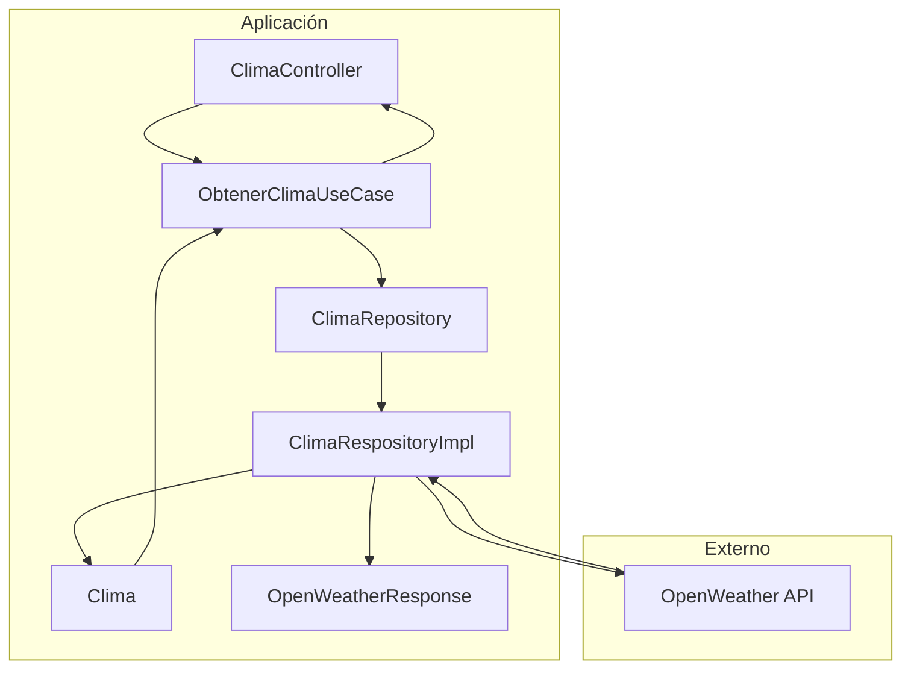

# Clima API (Java + Spring Boot)

Servicio REST minimalista para consultar el clima actual de una ciudad usando la API de OpenWeather. Está diseñado como un ejemplo con arquitectura limpia, separación de responsabilidades y configuración externa que facilita su uso como base para proyectos más grandes.

---

## Tabla de contenidos

- [Descripción](#descripción)
- [Características](#características)
- [Arquitectura](#arquitectura)
- [Stack tecnológico](#stack-tecnológico)
- [Requisitos previos](#requisitos-previos)
- [Instalación y ejecución](#instalación-y-ejecución)
  - [Variables de entorno / configuración](#variables-de-entorno--configuración)
  - [Ejecutar en desarrollo](#ejecutar-en-desarrollo)
  - [Construir el JAR](#construir-el-jar)
- [API / Endpoints](#api--endpoints)
  - [Ejemplos de uso](#ejemplos-de-uso)
  - [Ejemplo de respuesta](#ejemplo-de-respuesta)
- [Estructura del proyecto](#estructura-del-proyecto)
- [Componentes clave](#componentes-clave)
- [Pruebas](#pruebas)
- [Despliegue](#despliegue)
- [Mejoras sugeridas](#mejoras-sugeridas)
- [Contribuir](#contribuir)
- [Solución de problemas](#solución-de-problemas)
- [Licencia y contacto](#licencia-y-contacto)

---

## Descripción

`Clima API` es una aplicación REST basada en Spring Boot que ofrece una consulta rápida del clima actual de una ciudad a nivel mundial. La aplicación:

- recibe la ciudad como parámetro en la URL,
- llama a OpenWeather para obtener datos reales,
- transforma la respuesta externa a un modelo de dominio simple,
- devuelve un JSON limpio al consumidor.

Está pensada como proyecto educativo o una capa de servicio que puede integrarse fácilmente en aplicaciones web, móviles o microservicios.

## Características

- Endpoint REST para consultar el clima de cualquier ciudad del mundo.
- Integración con OpenWeather usando `HttpClient` de Java.
- Conversión de respuesta externa a un modelo de dominio `Clima`.
- Separación de responsabilidades mediante capas de controlador, caso de uso y adaptador.
- Configuración externa mediante variables de entorno o archivo `.env`.
- Documentación OpenAPI/Swagger UI disponible en el servicio.
- Respuesta JSON lista para consumir por frontends o APIs.

## Arquitectura

El proyecto sigue un patrón de capas simple con responsabilidad única:

- `Controller` recibe la petición HTTP.
- `Use Case` valida los parámetros de entrada.
- `Repository` abstrae la llamada a la API externa.
- `Adapter` implementa el acceso a OpenWeather.
- `DTO` modela la respuesta de OpenWeather.
- `Domain` expone el modelo `Clima`.

### Diagrama de flujo de solicitud

```mermaid
flowchart LR
    A[Cliente HTTP] -->|GET /api/V1/clima/{ciudad}| B[ClimaController]
    B --> C[ObtenerClimaUseCase]
    C --> D[ClimaRepository]
    D --> E[ClimaRespositoryImpl]
    E -->|HTTP request| F[OpenWeather API]
    F -->|JSON| E
    E -->|Clima| C
    C -->|JSON| B
    B -->|JSON| A
```

### Diagrama de arquitectura



---

## Stack tecnológico

- Java 17+ (recomendado)
- Spring Boot 4.x
- Maven
- Gson
- Java HttpClient (`java.net.http`)
- springdoc-openapi para documentación automática
- spring-dotenv para cargar variables de entorno desde `.env`
- Spring Boot DevTools para desarrollo en caliente

## Requisitos previos

- JDK 17 o superior instalado.
- Maven disponible, o usar el wrapper incluido (`mvnw` / `mvnw.cmd`).
- API key válida de OpenWeather.

## Instalación y ejecución

1. Clona el repositorio y ve al directorio del proyecto:

```bash
git clone <repo-url>
cd clima_api
```

2. Configura las variables necesarias en el entorno o en un archivo `.env`.

### Variables requeridas

- `OPENWEATHER_API_KEY` — clave de API de OpenWeather.
- `OPENWEATHER_API_URL` — URL base de la API, por ejemplo `https://api.openweathermap.org/data/2.5/weather`.
- `SERVER_PORT` — puerto donde se levantará la aplicación, por ejemplo `8080`.

Ejemplo de archivo `.env`:

```bash
OPENWEATHER_API_KEY=tu_api_key_aqui
OPENWEATHER_API_URL=https://api.openweathermap.org/data/2.5/weather
SERVER_PORT=8080
```

> `src/main/resources/application.properties` ya define `spring.config.import=optional:file:.env[.properties]`, por lo que el proyecto carga el `.env` si existe.

### Ejecutar en desarrollo

En Linux/macOS:

```bash
./mvnw spring-boot:run
```

En Windows (PowerShell o cmd):

```powershell
mvnw.cmd spring-boot:run
```

O con Maven instalado:

```bash
mvn spring-boot:run
```

La documentación Swagger UI estará disponible en:

```bash
http://localhost:8080/swagger-ui.html
```

### Construir el JAR

```bash
./mvnw clean package
```

En Windows:

```powershell
mvnw.cmd clean package
```

El ejecutable compilado quedará en `target/clima_api-0.0.1-SNAPSHOT.jar`.

## API / Endpoints

Base URL: `http://localhost:{SERVER_PORT}/api/V1/clima`

La documentación OpenAPI generada por `springdoc` está disponible en `/swagger-ui.html`.

### Endpoint principal

- `GET /api/V1/clima/{ciudad}`

Parámetros:

- `ciudad` — Nombre de la ciudad a consultar. El valor se codifica internamente en la URL.

Comportamiento:

- Valida que la ciudad no sea nula, vacía o en blanco.
- Consulta OpenWeather con el nombre de ciudad proporcionado para obtener clima global.
- Retorna un objeto `Clima` en JSON.

### Ejemplos de uso

Consultar el clima de Santa Cruz:

```bash
curl -s "http://localhost:8080/api/V1/clima/Santa%20Cruz"
```

Consultar el clima de La Paz usando el código de país `BO` (Bolivia):

```bash
curl -s "http://localhost:8080/api/V1/clima/La%20Paz,BO"
```

Si ejecutas el servicio en el puerto 8080, la URL completa será:

```bash
http://localhost:8080/api/V1/clima/Santa%20Cruz
```

### Ejemplo de respuesta

```json
{
  "ciudad": "Santa Cruz",
  "temperatura": 27.5,
  "humedad": 64,
  "descripcion": "algo de nubes"
}
```

## Estructura del proyecto

```
├── pom.xml
├── src
│   ├── main
│   │   ├── java
│   │   │   └── com/alura/clima_api
│   │   │       ├── ClimaApiApplication.java
│   │   │       ├── application/usecase/ObtenerClimaUseCase.java
│   │   │       ├── domain/model/Clima.java
│   │   │       ├── domain/port/ClimaRepository.java
│   │   │       └── infrastructure
│   │   │           ├── adapter/ClimaRespositoryImpl.java
│   │   │           ├── controller/ClimaController.java
│   │   │           └── dto/OpenWeatherResponse.java
│   │   └── resources/application.properties
│   └── test/java/.../ClimaApiApplicationTests.java
```

## Componentes clave

- `ClimaController`:
  - Expone el endpoint REST.
  - Recibe `ciudad` como `PathVariable`.
  - Serializa la respuesta a JSON con `Gson`.

- `ObtenerClimaUseCase`:
  - Valida el parámetro de entrada.
  - Orquesta la consulta al repositorio.
  - Retorna el modelo de dominio `Clima`.

- `ClimaRepository`:
  - Interfaz que define la operación `obtenerPorCiudad(String ciudad)`.
  - Permite desacoplar el caso de uso de la implementación concreta.

- `ClimaRespositoryImpl`:
  - Implementa la llamada HTTP a OpenWeather.
  - Construye la URL con parámetros: `q={ciudad}`, `appid`, `units=metric`, `lang=es`.
  - Parsea la respuesta JSON en `OpenWeatherResponse`.
  - Retorna un objeto `Clima` con datos normalizados.

- `OpenWeatherResponse`:
  - DTO que representa la estructura de respuesta de OpenWeather.
  - Incluye la temperatura, humedad y descripción.

## Pruebas

El proyecto cuenta con pruebas unitarias básicas en `src/test/java`.

La dependencia `spring-boot-starter-webmvc-test` se utiliza para ejecutar pruebas de la capa web.

Ejecuta todos los tests con:

```bash
./mvnw test
```

En Windows:

```powershell
mvnw.cmd test
```

## Despliegue

1. Genera el artefacto:

```bash
./mvnw clean package
```

2. Ejecuta el JAR con las variables de entorno configuradas:

```bash
OPENWEATHER_API_KEY=tu_api_key OPENWEATHER_API_URL=https://api.openweathermap.org/data/2.5/weather SERVER_PORT=8080 java -jar target/clima_api-0.0.1-SNAPSHOT.jar
```

En PowerShell:

```powershell
$env:OPENWEATHER_API_KEY='tu_api_key'
$env:OPENWEATHER_API_URL='https://api.openweathermap.org/data/2.5/weather'
$env:SERVER_PORT='8080'
java -jar target\clima_api-0.0.1-SNAPSHOT.jar
```

## Mejoras sugeridas

- Manejar errores HTTP de forma explícita y devolver códigos 4xx/5xx apropiados.
- Añadir validación de parámetros más completa.
- Soportar nombres de ciudad con país opcional para mejorar precisión global.
- Agregar caché en memoria o Redis para reducir llamadas a OpenWeather.
- Añadir pruebas de integración que simulen la API externa (por ejemplo WireMock).
- Registrar métricas y logs estructurados.

## Contribuir

1. Haz un fork del repositorio.
2. Crea una rama nueva para tu cambio.
3. Añade tests y verifica que el proyecto compila.
4. Envía un Pull Request con detalles claros del cambio.

## Solución de problemas

- `Error al obtener el clima:` significa que OpenWeather devolvió una respuesta de error.
- Revisa que `OPENWEATHER_API_KEY` y `OPENWEATHER_API_URL` estén bien configurados.
- Si la aplicación no arranca, revisa el puerto en `SERVER_PORT`.
- Para ver logs de Maven, utiliza `./mvnw -X clean package`.

## Licencia y contacto

Proyecto de ejemplo para uso educativo. Si deseas sugerir mejoras, abre un issue o un pull request en el repositorio.
